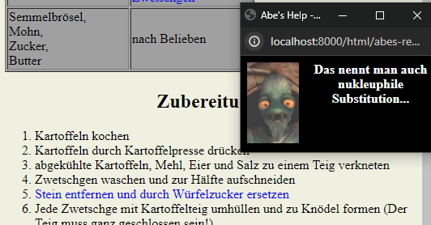

Miscellaneous small html projects (might contain css / js).

* [*1861 Calculator*](html/1861_Calculator.html): Keeps track of money, shares, and dividend payouts for efficiently playing the board game [1861](https://boardgamegeek.com/boardgame/23817/1861-railways-russian-empire). It can easily be adjusted to also cover other [18xx](https://en.wikipedia.org/wiki/18XX) variants.
* [*Abe's recipes*](html/abes-recipes/index.htm): Proof of concept for animation based one script-controlled image display. Also shows cross-frame control and timeout management. Requires to be run in a web server in order to make it run in modern web browsers (and their tightened security policies) - also popups need to be enabled.

# How To Start

Standalone `html` pages can be opened directly from the file system:

Otherwise, start a webserver in the workspace root by calling `server.sh`.

Then, the entry points are here:
* `http://localhost:8000/html/abes-recipes/index.htm`

# Gallery

|  |
| :--: |
| [Abe](https://en.wikipedia.org/wiki/Oddworld:_Abe%27s_Oddysee) comments on the mouse position including animation of him speaking |
